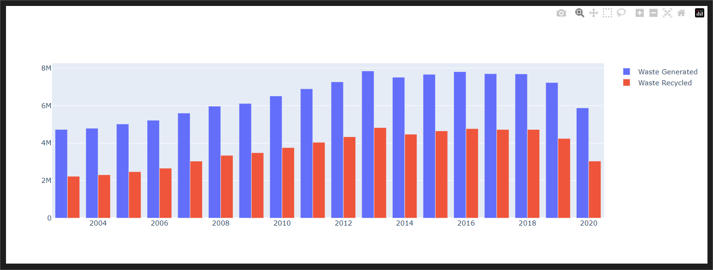
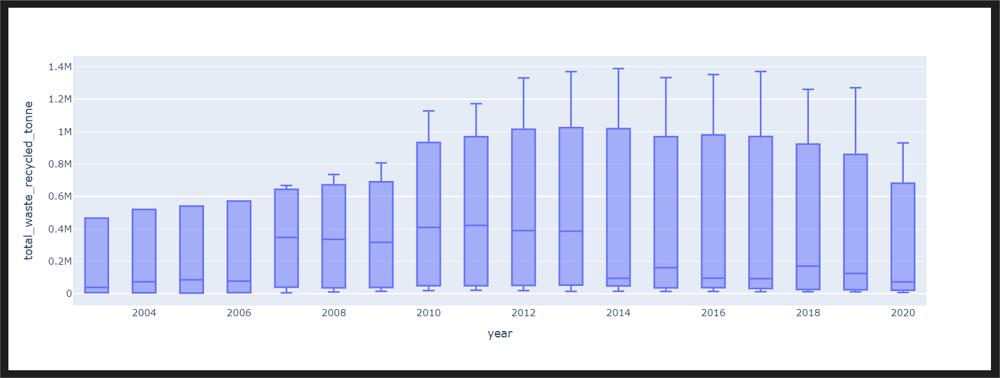
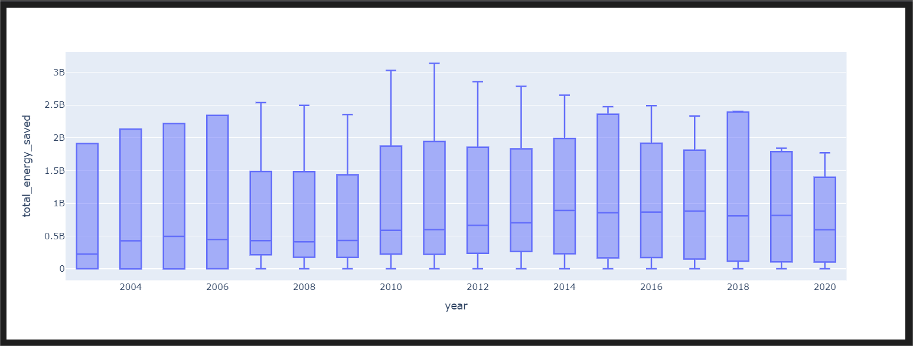
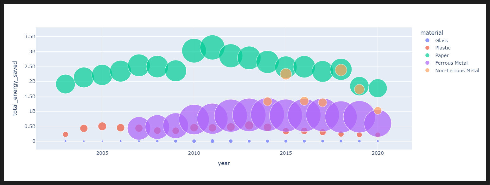

## Visualizations

### 1. Waste Generated vs Waste Recycled (2003–2020)

This bar chart compares the total waste generated and waste recycled in Singapore from 2003 to 2020. It highlights:
- The steady increase in waste generated over the years.
- Recycling efforts that fluctuate but show improvement in certain years.
- The gap between waste generated and recycled, indicating the need for increased recycling initiatives.

---

### 2. Total Waste Recycled (2003–2020) - Box Plot

This box plot represents the yearly distribution of total waste recycled (in tonnes) from 2003 to 2020 in Singapore. Key insights:
- The median recycling rate shows steady growth until around 2014.
- The variation in recycled waste increased significantly after 2008, indicating larger fluctuations in recycling efforts.
- After 2016, the spread seems to stabilize, suggesting improved waste recycling consistency.

---

### 3. Total Energy Saved (2003–2020) - Box Plot

This box plot illustrates the total energy saved annually from 2003 to 2020. Key observations:
- The median energy saved remains consistent throughout the years.
- There is significant variability between the minimum and maximum energy saved in most years, especially after 2010.
- Outliers are less frequent, indicating a relatively stable trend after 2014.

The plot helps visualize the distribution and spread of total energy saved over the years, with whiskers representing the full range of values.

---

### 4. Total Energy Saved by Recycling Materials (2003–2020) - Bubble Chart

This bubble chart visualizes the total energy saved by recycling various materials between 2003 and 2020. Key observations:
- **Paper** contributes the highest energy savings consistently throughout the period.
- **Ferrous Metal** shows a significant increase in energy saved from 2010 onward.
- **Plastic and Non-Ferrous Metal** remain relatively small contributors compared to Paper and Ferrous Metal.
- The bubble size indicates the magnitude of energy saved for each material in a given year, highlighting trends and shifts over time.
